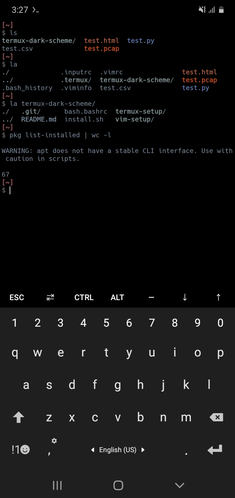
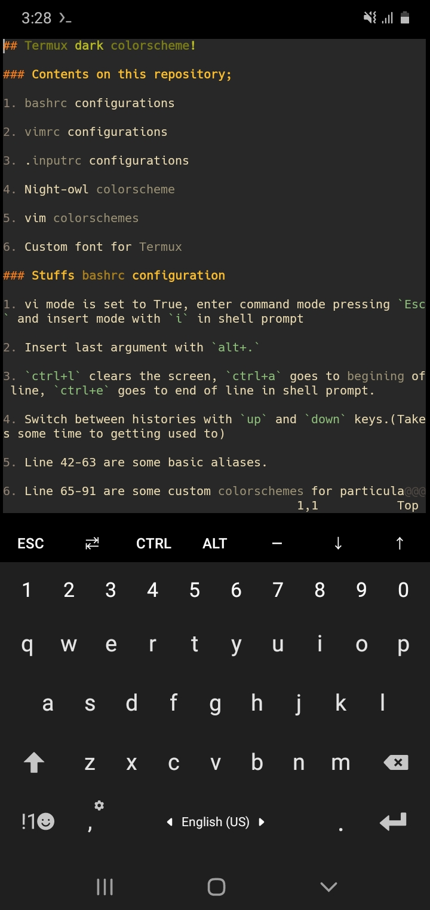
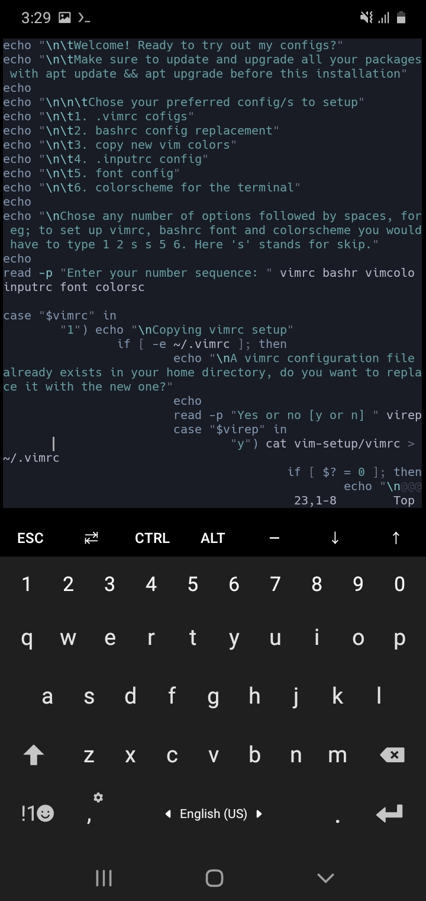
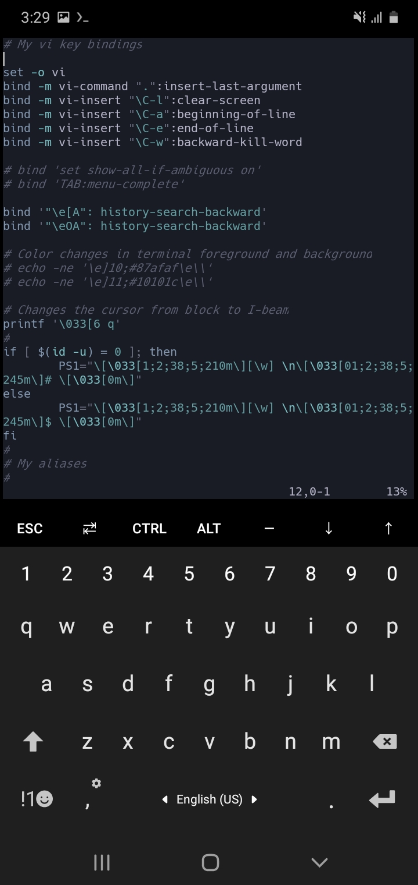
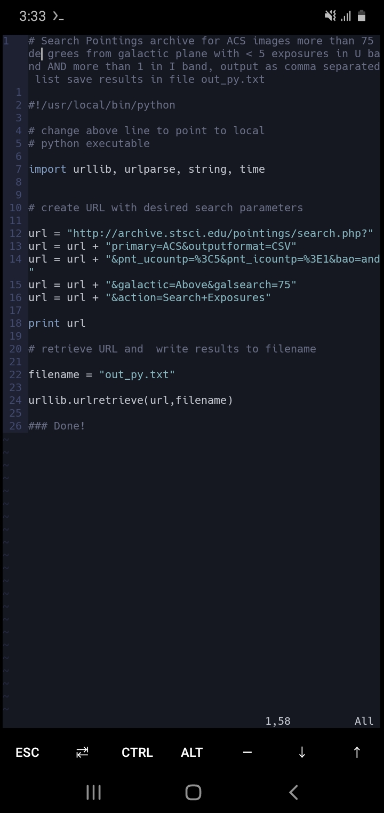
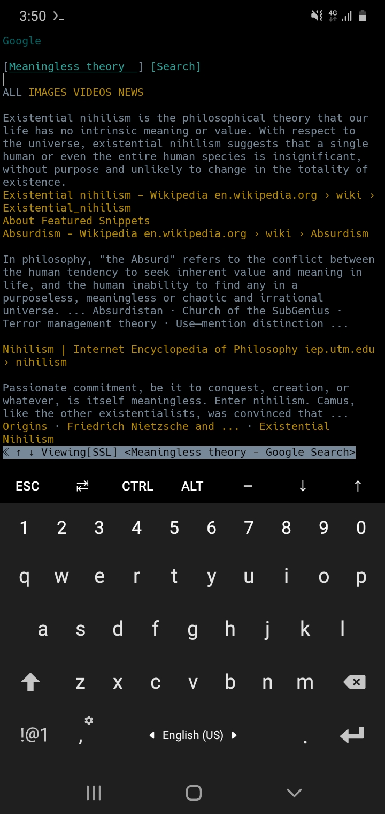

## Termux dark colorscheme!

### Contents on this repository;

1. bashrc configurations

2. vimrc configurations

3. .inputrc configurations

4. Night-owl colorscheme

5. vim colorschemes

6. Custom font for Termux

### Stuffs bashrc configuration

1. vi mode is set to True, enter command mode pressing `Esc` and insert mode with `i` in shell prompt

2. Insert last argument with `alt+.`

3. `ctrl+l` clears the screen, `ctrl+a` goes to begining of line, `ctrl+e` goes to end of line in shell prompt.

4. Switch between histories with `up` and `down` keys.(Takes some time to getting used to)

5. Line 42-63 are some basic aliases.

6. Line 65-91 are some custom colorschemes for particular file types just to identify them easily.

4. If you use autocd(a python program to quickly switch directories), uncomment line 7 to 9 on the bash.bashrc configurations

6. Uncomment line 1-6 if you want command not found message along with suggested packages everytime you put in a wrong command.

7. Go back one directory with `..` and two directories with `...`

### Stuffs in vimrc

Nothing too fancy in this vimrc.

Toggle spell check with spy and spn

### Stuffs in .inputrc

1. Sets the bell vibration to null everytime you hit backspace on an empty shell prompt

2. Different cursors for input mode and command mode for vim mode in shell prompt

### Night-owl colorscheme

A customized version of a darker colorscheme for termux.

### Vim colorschemes

Some vim colorschemes.

### Custom font for Termux

The font name is **Hack**, it's probably from font-awesome. Be sure to run `termux-reload-settings` after placing colorschemes and font.ttf under `~/.termux` direcotory.

### Installation

Clone the repo, cd into the repo, run install.sh with `sh install.sh`.

Feel free to support at [bitcoin] 13erq7DDXDuqqBohht3UNyuJCXtpJcWGSe
